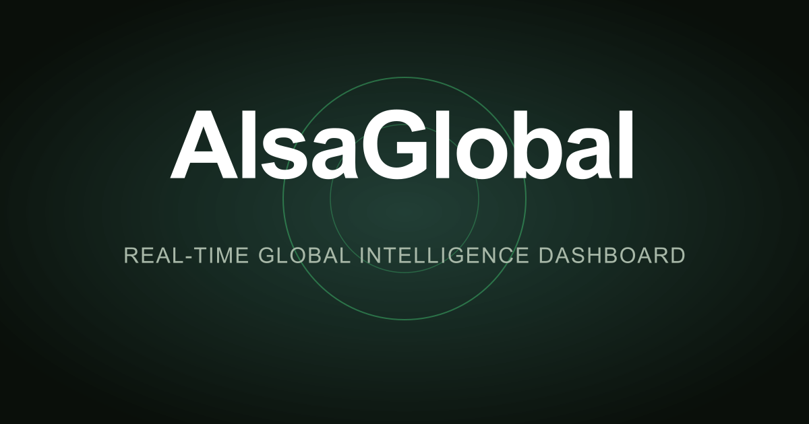

# AlsaGlobal

**Real-time global intelligence dashboard** — live conflict tracking, military flight monitoring, climate events, financial markets, and geopolitical risk scoring in a unified situational awareness interface.



---

## Live Data Sources

| Panel | Source | Update Frequency |
|-------|--------|-----------------|
| Earthquakes | USGS Earthquake Catalog | Real-time |
| Wildfires | NASA FIRMS satellite | Real-time |
| Climate Disasters | NASA EONET v3 | 20-min cache |
| Air Quality | WAQI (15,000+ stations) | 10-min cache |
| Military Flights | OpenSky Network | Live ADS-B |
| Maritime Warnings | NGA MSI API | Real-time NOTAMs |
| Cyber Threats | Cloudflare Radar | Real-time |
| Prediction Markets | Polymarket Gamma API | 10-min cache |
| Conflict Events | ACLED / UCDP | Daily |
| Financial Markets | Finnhub WebSocket | Real-time |
| Commodities | Stooq | 3-min cache |
| Economic Indicators | FRED API | Daily |
| Energy Data | EIA API | Daily |
| Submarine Cables | NGA + cable operator data | Daily |
| News | 500+ RSS feeds across 15 categories | 15-min cache |

---

## Run Locally

**Requirements:** Node.js 18+

```bash
git clone https://github.com/your-org/alsaglobal.git
cd alsaglobal
npm install
npm run dev
```

Open **http://localhost:3001**

The dashboard starts with all public data sources active. No API keys required for the core experience.

### Environment Variables (Optional)

Copy `.env.example` to `.env` and fill in keys to unlock more features:

```bash
cp .env.example .env
```

| Variable | Provider | What It Unlocks |
|----------|----------|----------------|
| `GEMINI_API_KEY` | Google AI Studio (free) | AI news briefs, summaries, scenario analysis |
| `WAQI_TOKEN` | aqicn.org (free) | Live air quality for 15,000+ stations |
| `OPENSKY_CLIENT_ID` / `SECRET` | OpenSky Network (free) | Live military flight tracking |
| `AISSTREAM_API_KEY` | aisstream.io (free) | Real-time ship positions |
| `FINNHUB_API_KEY` | Finnhub (free tier) | Real-time stocks, crypto, forex |
| `FRED_API_KEY` | St. Louis Fed (free) | 800k+ US economic data series |
| `EIA_API_KEY` | US Energy Info Admin (free) | Oil, gas, electricity data |
| `NASA_FIRMS_API_KEY` | NASA FIRMS (free) | Satellite wildfire hotspots |
| `CLOUDFLARE_API_TOKEN` | Cloudflare (free) | Internet outage & DDoS tracking |
| `ACLED_EMAIL` / `PASSWORD` | ACLED (registration required) | Live armed conflict events |

---

## Build for Production

```bash
npm run typecheck          # type-check
npm run build:full         # production build → dist/
```

Deploy the `dist/` folder to any static host:

```bash
# Vercel
vercel deploy

# Netlify
netlify deploy --dir=dist --prod

# Cloudflare Pages
wrangler pages deploy dist
```

---

## Tech Stack

| Layer | Technologies |
|-------|-------------|
| Frontend | Vanilla TypeScript, Vite |
| Maps | globe.gl + Three.js (3D globe), deck.gl + MapLibre GL (flat map) |
| AI | Gemini 2.5 Flash / Groq / OpenRouter / Ollama (local) |
| API Contracts | Protocol Buffers (sebuf) |
| Caching | In-memory + Redis (Upstash, optional) |
| Charts | D3.js |

---

## Attribution & License

AlsaGlobal is built on [World Monitor](https://github.com/koala73/worldmonitor) by **Elie Habib**, licensed under **AGPL-3.0**.

- Original copyright: Copyright (C) 2024–2026 Elie Habib
- This fork: AlsaGlobal — personal/internal self-hosted deployment
- The [LICENSE](LICENSE) file is unchanged and must be preserved in all distributions
- Commercial use requires a separate license from the upstream author
